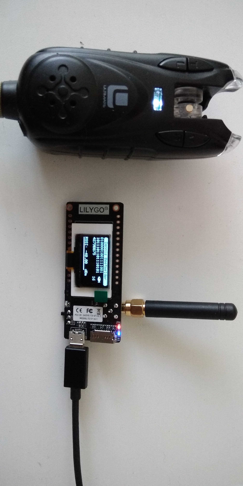
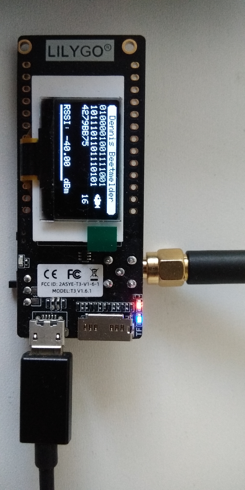

# SX1278 Fishing Bite Detector
This is an Arduino project using the **SX1278 transceiver** in **FSK-mode**. 
The board i used is a **LilyGO TTGO ESP32 433 (T3_v1.6.1 20210104)**. 
I used **RadioLib**, which i like a lot because it works well: https://github.com/jgromes/RadioLib 
The LilyGO board features an **SSD1306 OLED**: I used the AdaFruit library. 
(I am not yet using the board WiFi and/or BlueTooth). 
 
The SX1278 is used for receiving a fishing bite detector signal. 
The bite-detector is from the brand Ultimate. I do not know what model it is. (it's not mine, and i didn't buy it). 
 
The radio receives the **2-FSK** signal with a center frequency of **433.96 MHz**. 
The bitrate is very low, **0.666 bits per second**. 
The sent packet-format is quite simple: **No preamble, no syncword, no CRC, just a 32-bit value**. 
A packet ends with an extra long pulse, followed by an extra long pause (in between multiple sent packets). 
The 0-bit pulse has a shorter duration than the 1-bit pulse. 
In fact, the signal looks a lot like a morse-code transmission. 
 
I do not use any packet-mode, nor bit-sequencer. Only the signal-strength is used to interpret the transmissions. 
The bite-detector has some drift around the FSK center-frequency (about -/+ 3.5KHz). To compensate for that drift, i had to use the **AFC (auto frequency correction)**. 

